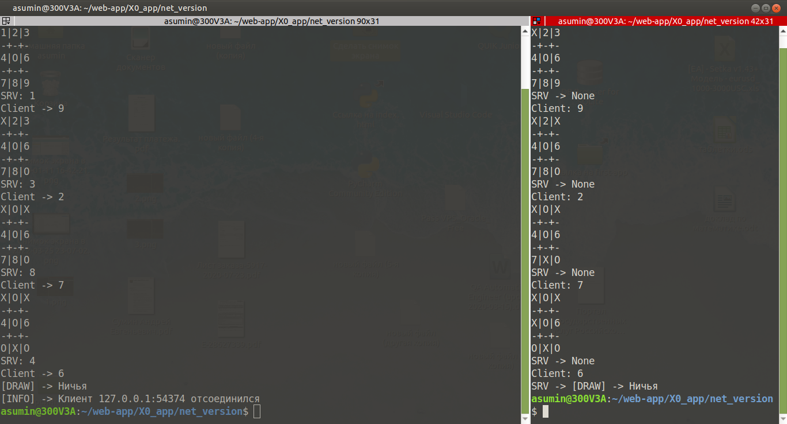

## Игра "Крестики Нолики" 
Сетевая версия игры: 
-   Используется модуль socket для серверной и клиентской части игры 
-   Используется протокол TCP/IP v4
-   Сервер слушает порт 2022
-   Обмен сообщениями происходит поочерёдно

     

     

     

     

